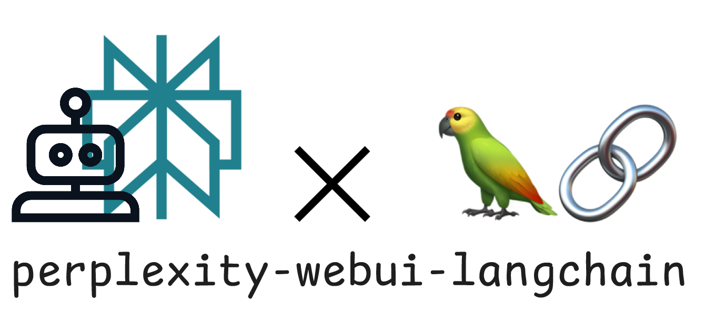
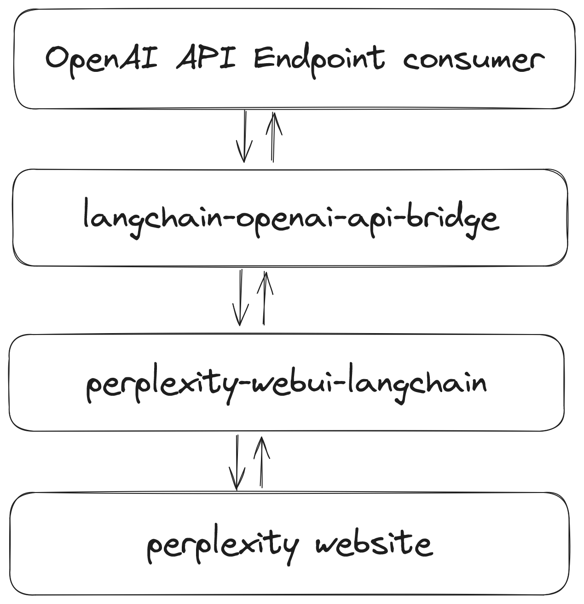

# perplexity-webui-langchain



A wrapper around the Perplexity WebUI using Langchain. Under the hood, relies on [reteps/perplexityai](https://github.com/reteps/perplexityai).

## Usage

```python
from perplexity_webui_langchain import PerplexityWebUIChatModel
from langchain_core.messages import HumanMessage

import asyncio

llm = PerplexityWebUIChatModel(email="peteras4@illinois.edu")

async def main():
    msg = await llm.ainvoke([
        HumanMessage(content="What is the capital of Illinois?"),
    ])
    print(msg.content)
    async for msg in llm.astream("hello"):
        print(msg.content, end="|", flush=True)

    async for msg in llm.astream("what was my last message?", followup=True):
        print(msg.content, end="|", flush=True)
if __name__ == "__main__":
    asyncio.run(main())
```

## Install

```bash
python3 -m pip install git+https://github.com/reteps/perplexity-webui-langchain.git
```

## Motivation

- The perplexity pro plan supports custom LLMs (e.g. claude3.5) on the WebUI (and can be scripted through a WebSocket)
- I want to be able to use these custom LLMs in other settings, like autocomplete in my code editor
- I can hook up Langchain as an OpenAI chat completions compatible endpoint using [this repo](https://github.com/samuelint/langchain-openai-api-bridge)

